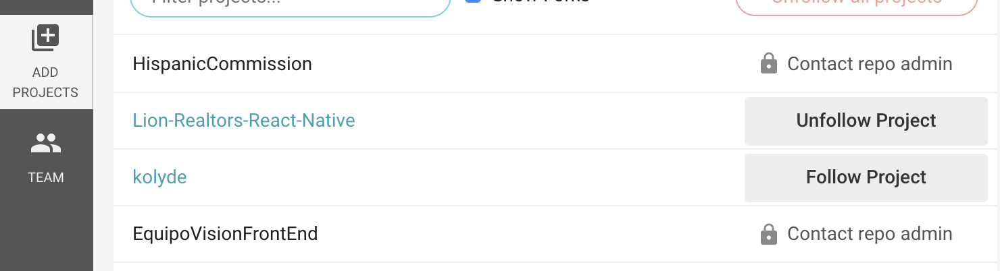

# Circle CI Setup (React Native - Expo)

This covers how to add continuous integration with Circle CI on your React Native project. This assumes that the project was made via expo: `expo init`, **not** via `create-react-native-app`.

## Step 1: Set up the repo

Go to the Circle CI page [here](https://circleci.com/) and log in using GitHub. You will usually be redirected to a list of repos, but if not, the add projects tab on the left will take you there. This will give you access to add CI to all your personal repos, as well as repos in your organizations. Find the project that you want to add.

By default, you may not have access to add the repo. If you don't, we will see the "Contact Repo Admin":



In this case, contact your PM to grant you access for now. Once that it done, there should be a blue button on the right to set up. Click that and you're taken to an initilization page with instructions.

- Create a folder called `.circleci` and inside there, create a file named `config.yml`.
- CCI gives you a sample config file if you select the environment. I selected Linux/Node, but had to modify the file somewhat. Here's what it looks like:

```
# Javascript Node CircleCI 2.0 configuration file
#
# Check https://circleci.com/docs/2.0/language-javascript/ for more details
#
version: 2
jobs:
  build:
    docker:
      # specify the version you desire here
      - image: circleci/node:10.8

      # Specify service dependencies here if necessary
      # CircleCI maintains a library of pre-built images
      # documented at https://circleci.com/docs/2.0/circleci-images/
      # - image: circleci/mongo:3.4.4

    working_directory: ~/repo

    steps:
      - checkout

      # Download and cache dependencies
      - restore_cache:
          keys:
          - v1-dependencies-{{ checksum "package.json" }}
          # fallback to using the latest cache if no exact match is found
          - v1-dependencies-

      - run: npm install

      - save_cache:
          paths:
            - node_modules
          key: v1-dependencies-{{ checksum "package.json" }}

      # run tests!
      - run: npm test
```

Important changes inclue make sure the version of node is correct, and if you build our your project with `yarn` instead of `npm` that your install and test scripts are appropriate.

---

Tip from @carlosvargas:

One thing to keep in mind with jest, is the `testEnvironment` (https://jestjs.io/docs/en/configuration#testenvironment-string). I had to switch mine to `node` by updating my `package.json` with

```
  "jest": {
    "testEnvironment": "node"
  },
```

## You'll probably have to switch yours to do node environment in the future if you'll be doing server side tests only (Jest will bug you about it when you run the tests with a yellow warning).

So we've told CCI how to build our code, and what to run when testing, but chances are you don't have a method of testing. On to step 2!

## Step 2: Set up your test

This is where things get a little tricky with expo. There is a package for expo that handles jest testing. The problem is that as of Feb. 2019, there's a month long issue by developers acknowledging it doesn't work as documented. Here's what I did to get it going. You will almost certainly want to do this on a new branch.

- Install `jest-expo` as a dev dependency (`npm install jest-expo --save-dev`)
- Create a file in your project root names `jest.config.js` and insert the following code:

```javascript
module.exports = {
  preset: "jest-expo",
  transform: {
    "\\.js$": "<rootDir>/node_modules/react-native/jest/preprocessor.js",
  },
};
```

- Now that we've installed and configured jest, lets add it to our config file to make sure it actually runs. Go into your `package.json` file and add the following line to your "scripts" section: `"test": "jest"`. Now running `npm test` should run jest tests.
- But wait! We've set up our utility to run tests, but we don't actually have a test to run! Let's fix that:
  - Create a folder named `__tests__` in your root folder.
  - Create a file inside said test folder. Naming isn't important, I stuck with the documentation name: `Example-test.js`.
  - Insert the following code inside that file:

```
it('works', () => {
    expect(1).toBe(1);
  });
```

Now we've created a test which essentially checks the value of the statement `1 === 1` which is always true, so this test should always pass.

## Step 3: Test locally

Run `npm test`. It should begin jest and run our always passing test. It's worth noting that this step was where I was running into problems getting 'Unexpected token' errors using the documented method of setting up and had to find the above answer on GitHub.

## Step 4: Add, Commit, Push your branch

And watch the magic happen. On CircleCI it will run our always true test with that branch and should give you a passing grade. When you make a pull request for the branch you just did, and any future branches, a CCI test build will run and the results will display in GitHub above the merge button. Awesome! You may not wish to delete the branch immediately though, that's because of the following caveat:

After completing CI setup, any other branches that are currently being worked on that started prior to the CI setup will always get build failures. This is because they don't have a CCI config or testing set up on their machine. You will have to merge those goodies into any feature branches that weren't branched off after you completed the setup.

With that, CI setup is complete. Look to this section for some ideal tests to run in the future.
