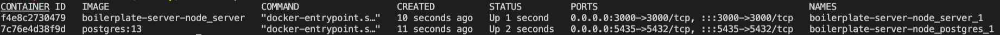

# Docker

Docker is an amazing container environment tool that can be used to normalize development and production environments.

## Installing Docker

If you have already run our [Laptop Script](https://github.com/Shift3/laptop) then Docker should already be installed for you.

Installing docker on different operating systems:
- Mac: [Docker Installation for Mac](https://docs.docker.com/docker-for-mac/install/)
- Ubuntu: [Docker Installation for Ubuntu](https://docs.docker.com/install/linux/docker-ce/ubuntu/)
- Windows: [Docker Installation for Windows Requires Windows Pro](https://docs.docker.com/docker-for-windows/install/)
- Homebrew: `brew cask install docker` [Stackoverflow Resource](https://stackoverflow.com/questions/40523307/brew-install-docker-does-not-include-docker-engine)

Install docker compose:
- [Docker compose installation instructions](https://docs.docker.com/compose/install/)

## Using The Docker Cli

Docker for the most part is run from the terminal, the docker cli is fairly straight forward.

Docker cli documentation:
- [Docker Cli](https://docs.docker.com/engine/reference/commandline/cli/)

## Docker Files

Docker files are the building blocks of how docker runs your application. Each file contains layers in order to install the dependencies you need (node, python, mongo etc.) and run any other commands you may need to start your app!

Docker File Documentation:
- [Docker File Docs](https://docs.docker.com/engine/reference/builder/)

## Docker Compose Files

Docker compose files are where we can define the architecture in our application so docker can create containers for every service we need. We can use the compose file to easily set things like environment variables, exposed ports, data volumes and networks for our docker containers to talk over. We normally use compose files for development and then switch to a stack file for production!

Docker Compose File Documentation:
- [Docker Compose Docs](https://docs.docker.com/compose/compose-file/)

## Example configurations

  - [Nodejs](./nodejs)
  - [Django](./django)

## Examples from Internal Projects

  - [angular-boilerplate](https://github.com/Shift3/boilerplate-client-angular/blob/main/docker-compose.yml)
  - [node-boilerplate](https://github.com/Shift3/boilerplate-server-node/blob/develop/docker-compose.yml)

Generally a project should have three files for Docker support:

  - Dockerfile
  - docker-compose.yml
  - .dockerignore (copy of .gitignore)

## General Use and Tips

### How to start Docker

Starting Docker is very simple but there are definitely some commands to remember. In general the Docker daemon should be set up to start when your computer starts up. In order to run Docker commands, you will want to navigate to the root of your project, or the folder that contains your Docker files. Here are the files you should be looking for in your project:

1. Dockerfile
2. Dockerfile.dev or Dockerfile.prod (project specific)
3. docker-compose.yml or docker-compose.yaml

In most projects instead of just a Dockerfile, we usually split out the files into .dev and .prod. This allows us to make adjustments based on our environment and how the project is setup for development vs production.

The `docker-compose.yml` file is the one normally used to start Docker. Be sure to run Docker compose commands from the same directory as your compose file. To start up the project, simply run:

`docker compose up`

This command will start all of the services specified in the `docker-compose.yml` file, and run your application locally. When we only specify `up` we will lock our terminal to display the output of all the running containers in the Docker compose file. In some cases this is what we want, however we may not always want to see the output of every container, or lock our terminal to the containers. To avoid this, you can instead run `docker compose up -d` to run the containers in “detached” mode. This simply means that the containers will still start up, but the process now runs in the background detached from your terminal. This provides two benefits:

1. The containers are no longer locked to your terminal, and will continue to run if you close your terminal or exit the session
2. The container logs can now be viewed individually instead of all at once

In general the preference is to run in detached mode, that way you are free to use your terminal in other ways, and you won’t kill your containers when you exit the terminal session.

### How to tear down Docker

Tearing down Docker is a little more difficult and has a few more ways to do so. If you are not running the containers in detached mode, you can simply `ctrl c` in your terminal and compose will exit gracefully after a few seconds. If you are running the containers in detached mode, you will need to run `docker compose down` in order to stop all of the containers. In most cases, simply running down is the way to stop the containers, but if you ever need to destroy the images and volumes, you will need to run `docker compose down -v`. This command will not only stop the containers, but it will remove any images, volumes, and networks associated with the containers. You should only need to use the `-v` flag in rare occasions:

1. If you need or want to start fresh in a project, `docker compose down -v` will delete any data related and acts as a “reset” for the project. This is a destructive command and should be used with caution
    1. WARNING - this is completely destructive and you will not get your data back unless you have a backup
2. You need to reset your database and or change the database credentials
    1. This can be done through your database, but if you do change the user or password used with compose you may need to destroy the DB volume and restart
3. You want to test the project setup from scratch
    1. This may be helpful if a new teammate is having issues spinning up their project or you have made lots of changes to the project since it was started.

In general you should be shutting down the containers for your project daily using `docker compose down`. There may be more cases than listed above why we would also pass in the `-v` flag, but please do so with caution.

### How to exec into a Docker container

If you have a running container and want to jump into the container (similar to ssh), the `docker exec` command is what you need. This command is similar to ssh and will essentially put you into the container using the terminal specified. Before running the command, you need to get either the name of the container or the ID. To do this, run `docker ps` to get a list of all of your running containers. The output should look something like this:

From here either copy the container ID or the name of the container. Then run:

`docker exec -it <container id or name> bash`

This command will exec into the container and give you a bash shell to run commands with. From here you can treat it just like a unix command line, and run any commands you need. In order to get back out of the container, simply type `exit`

### How to get logs from your Docker container

Getting logs from your container is really important and can be done using the `docker logs` command. As with exec, we need the container id or name before running this command. Then run:

`docker logs <container id or name>`

To get a print of the logs for your container in your terminal. This command will only give you the logs of the container up until you run the command. If you would like a live feed of your container logs, simply run:

`docker logs <container id or name> -f`

This command will lock your terminal to an output of all logs in the container, until you press `ctrl c`.

### How to copy files in/out of your Docker container

If you need to get files from your container such as a database backup, or insert files into your container, you can do so using `docker cp`. This command is very similar to the unix command `scp` where we can push or pulls files from our container. As with any command targeting a container, we need the ID or name of the container before running the command. Once you have this, you then need to determine what you want to do. As with `scp` the command will follow a host to destination ordering. As an example, lets say we need to move a json file into our container, this would look like this:

`docker cp /path/to/file.json <container id or name>:/path/in/container/file.json`

Here we are copying the `file.json` from our file system into the container. Be sure to double check your path, both on your computer and where it will be going inside the container. As for an example of the reverse, here we would be pulling `file.json` from our container onto our computer:

`docker cp <container id or name>:/path/to/file.json /path/on/computer/file.json`

This command is super useful for database or file backups, or if you need to insert data files into your container!

### Useful Commands

There are a ton of Docker commands which can all be found here:

https://docs.docker.com/engine/reference/commandline/docker/

Here are all of the `docker compose` commands:

https://docs.docker.com/compose/reference/

We recommend getting familiar with the most used commands, and being comfortable using the above documentation for more advanced usage and learning.

That said there are a few that we use frequently which are listed below:

1. [docker cp](https://docs.docker.com/engine/reference/commandline/cp/) - Used to copy files between the container and your filesystem
2. [docker exec](https://docs.docker.com/engine/reference/commandline/exec/) - Used to run commands on a running container
3. [docker logs](https://docs.docker.com/engine/reference/commandline/logs/) - Used to fetch the logs of a container
4. [docker ps](https://docs.docker.com/engine/reference/commandline/ps/) - Lists all running containers
5. [docker ps -a](https://docs.docker.com/engine/reference/commandline/ps/) - Show all containers not just the ones that are currently running
6. [docker restart](https://docs.docker.com/engine/reference/commandline/restart/) - Used to restart one of more containers
7. [docker stats](https://docs.docker.com/engine/reference/commandline/stats/) - Used to display the resources your containers are using
8. [docker stop](https://docs.docker.com/engine/reference/commandline/stop/) - Used to stop a running container
9. [docker compose down](https://docs.docker.com/engine/reference/commandline/compose_down/) - Used to stop all docker compose services
10. [docker compose up](https://docs.docker.com/engine/reference/commandline/compose_up/) - Used to start all containers in a docker-compose.yml file

### General FAQ and Troubleshooting

#### I installed a new package, but when running my project the container cannot find the package. Why can’t my container find the package?

Depending on how the Dockerfile is set up, Docker may not be aware of the new package. In most cases, you can solve this by running `docker compose down` and then `docker compose up --build`. The `--build` is the real key here, which forces the container to rebuild itself and then will install any new dependencies!

#### I changed my database username (or password) and its not reflecting when I try to connect to the database. How can I change my database user or password?

If you used Docker to set up your database, the user and password are created when the container is created and this will not change unless the container is recreated. Before making any changes, backup your database, then run `docker compose down -v` and then `docker compose up` (with the new credentials in compose or through environment variables). NOTE: This will destroy your database, so if you need the data please back it up first.

Another option is to connect to the database using the old credentials, and create the user using the database language itself.

#### Docker is taking up a lot of disk space, how can I clean this up?

Docker images are the usual culprit here, and should be cleaned up from time to time. The normal way, is to use the prune command. If you run `docker image prune`, it will then remove any “dangling” images that are not being used. This can cause some builds to take longer, as it could remove layers used by other images. This is not a huge deal and is generally the right thing to do regardless. If you want a full list of options, and a comprehensive explanation of the command, you can read more here: https://docs.docker.com/engine/reference/commandline/image_prune/
