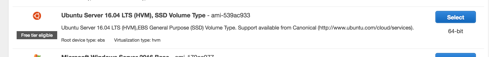
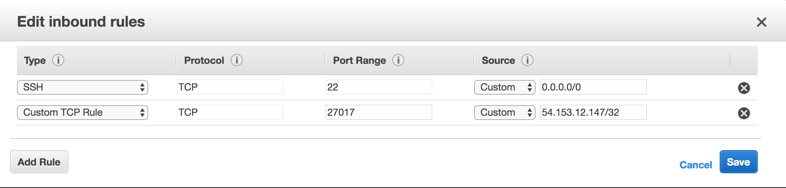

# MongoDB

### Set up MongoDB 
1. Log into aws.amazon.com under your _shift3_ account
2. Click on **EC2**
3. Click **Launch Instance**
4. Select the **Ubuntu Server 16.04 LTS** Instance type

    
5. Select the **t2.micro** instance and click **Review and Launch**
6. Configure your _Security Group_ **Incoming** port settings so that:
    *  _only_ the IP address of your client has access to port **27017**
    * Port 22 is open to all/**0.0.0.0**
        * When you're done, it should look similar to this: 
        with the port number changed to the port of your API that will be making the requests to your DB.
7. Select the existing pem key you want or create a new pem key for the instance
    * ## If you create a new pem key, make sure you download it as you will only have 1 chance to do so
8. Launch the instance
