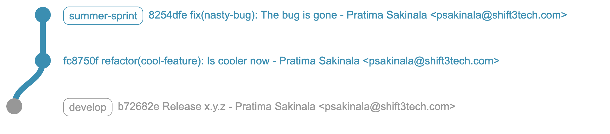
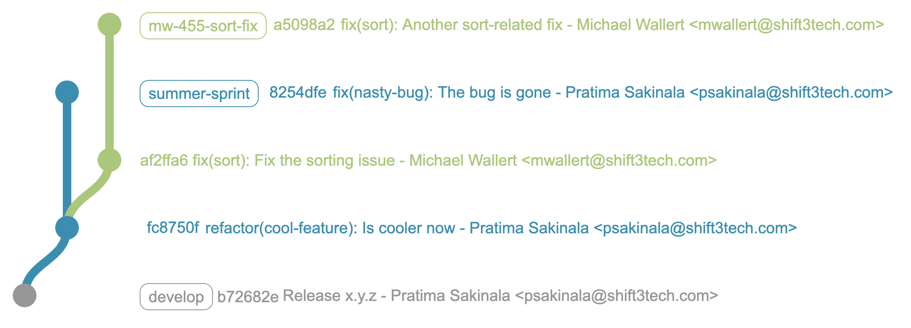
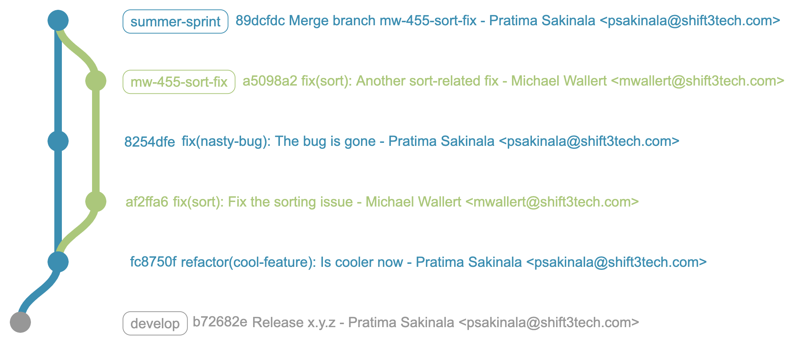
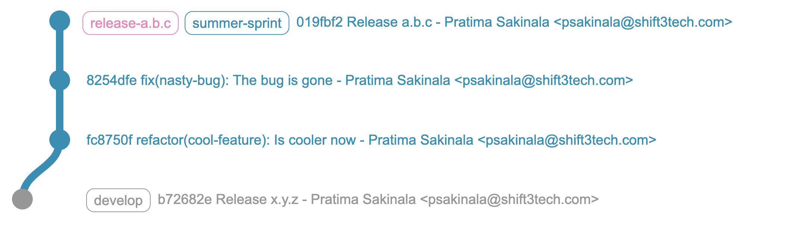
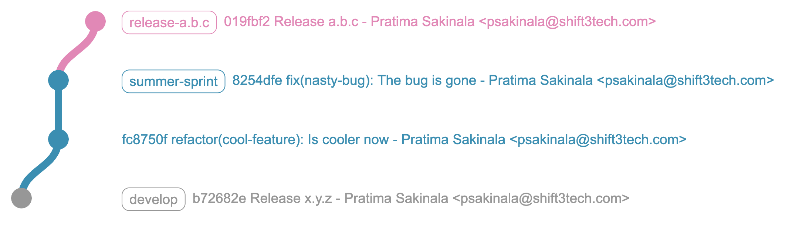
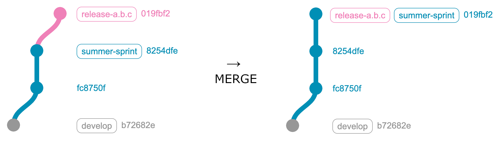
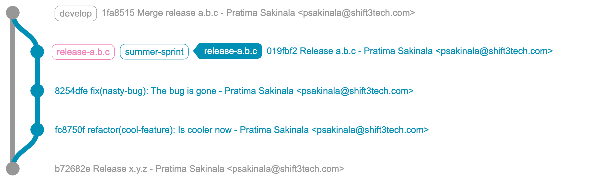
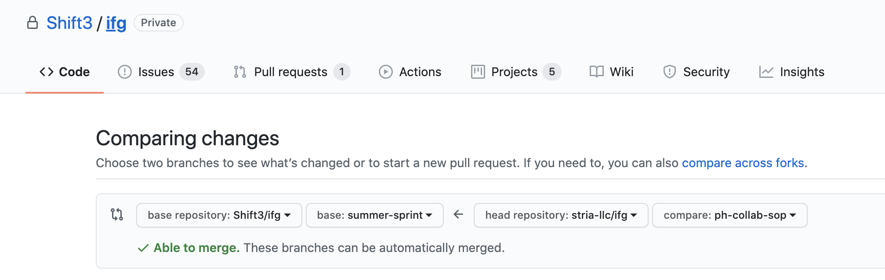

# Bitwise & Client Code Collaboration

## Definitions

- **Git**: A distributed source-control tool used to manage changes to
  software during development.
- **GitHub**: A cloud-based Git repository hosting service with many
  additional features such as issue tracking, visual metrics, automated
  workflows, and much more.
- **Commit**: Set of one or more file changes recorded in the Git
  repository that typically has a single parent commit.
- **Branch**: Named pointer to a commit
- **Tag**: A static marker that points to a specific commit, used to locate
  an important point in the revision history, such as a production release.
- **Rebase**: Git operation used to move or combine a series of commits
  along a branch to a new base commit.
- **Pull**: Git operation involving retrieving commits from a remote
  repository.
- **Push**: Git operation that sends commits to a remote repository.
- **Pull Request**: A collaborative feature of GitHub that allows developers
  to send and review formal requests for code to be pulled into a repository
  or branch.

## Git Branching Model

### Sprint Branches

Sprints are periods of active development and testing where new features and
fixes are bundled together and tested in the Bitwise sandbox prior to
deployment to the production environment. Each sprint gets a
distinct git branch where changes are committed. Below is an example of the
Summer Sprint branch with some fictitious commits.

<h3>Feature/Issue Branches</h3>

When a feature or fix is identified, an issue is created in the Shift3/ifg
GitHub repository. Code changes related to this feature are committed into
a feature branch off of the sprint branch. In the below example, Michael
is assigned an issue regarding sorting data in a table component of the application. An issue branch is created using a lowercase,
dasherized name briefly describing the feature or fix, always beginning with
the assignee's initials and the issue number corresponding to that feature
or bug report. In this case, it is `mw-455-sort-fix`.

Once a feature is completed, the corresponding feature branch is merged into
the active release branch—in this case: `summer-sprint`.

### Release Branches

Throughout a sprint, multiple releases may be deployed to the sandbox
environment for review by the client. Every release has a distinct release branch,
named `release-<version_number>`, e.g. `release-1.5.0`. Release branches
**may** exist at the head of the current sprint branch, or ahead:

**Even**:

**Ahead**:

### Production Releases

When the changes in a sandbox release have been approved by the client for
deployment to production, the corresponding (most recent) release branch is
tagged and deployed to the production environment. After the successful
deployment, the release branch is merged into the sprint branch (if not even).
The sprint branch is then merged into the mainline branch (develop).

**Only if ahead**:

**After tagging & mainline merge**:

## Client Collaboration

To aid Bitwise in the development process, the client will maintain a fork of the
repository and adhere to similar standards for commits, branching,
pull requests, and issue submission.

### Client issue branches

Issue branches for tasks/features being actively developed by the Client will
use the same branch naming convention described [above](#issue-branches),
using the client assignee initials. Pull requests for changes on Client issue
branches will target the branch created for the Shift3 assignee to the
corresponding issue, e.g. Foo Bars's changes on `fb-900-new-report` will
be sent in a pull request to `fd-900-new-report` if Foo Dar is the
assignee for issue #900.

### Client pull requests

Pull requests will be initiated by the Client developer using the pull
request template located in the repository under
`.github/PULL_REQUEST_TEMPLATE.md`. Pull requests will be initiated from the
repository and will specify the current sprint branch e.g.
`summer-sprint` as the base branch. The feature/issue branch in the Client
repository will be selected as the head branch to be merged. For example, the
pull request being created below shows the branch `fb-collab-sop` as the
head branch in the Client repository to be merged into the `summer-sprint`
branch in the repository.

### Client commits

We strongly recommend the client use the same commit message convention as Bitwise. This is detailed
in the Shift3 Standards & Practice repository, available [here](./commits.md#shift3s-convention-for-how-to-structure-write-and-use-your-commits)
