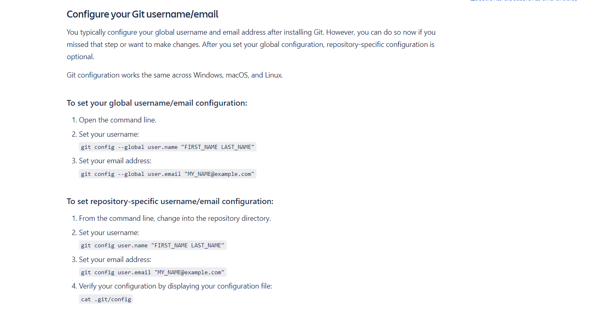

#### GitHub

- If you don't already have a GitHub account, create your account at [GitHub.com](https://github.com/)
- Only create a GitHub account with your work email if your Pod Lead request that of you.
- Here are references about [managing multiple accounts](https://docs.github.com/en/account-and-profile/setting-up-and-managing-your-personal-account-on-github/managing-your-personal-account/managing-multiple-accounts)
- Once an account has been created, it's time to configure your Git username/email.

  [</a>](https://support.atlassian.com/bitbucket-cloud/docs/configure-your-dvcs-username-for-commits/)
