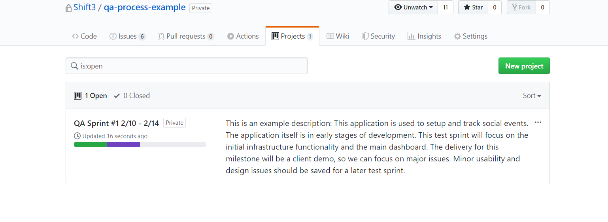
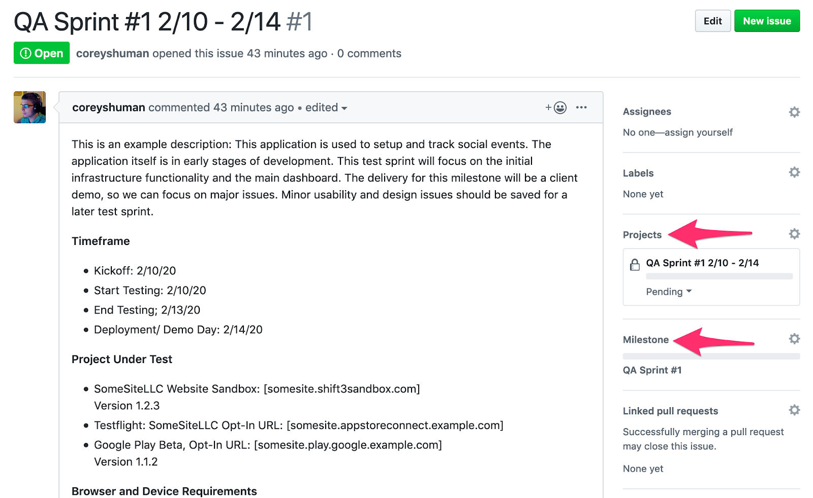
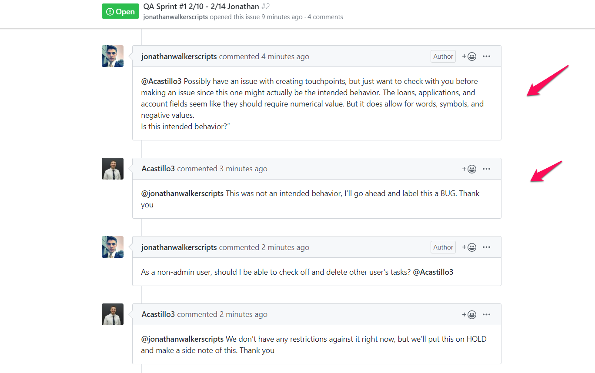
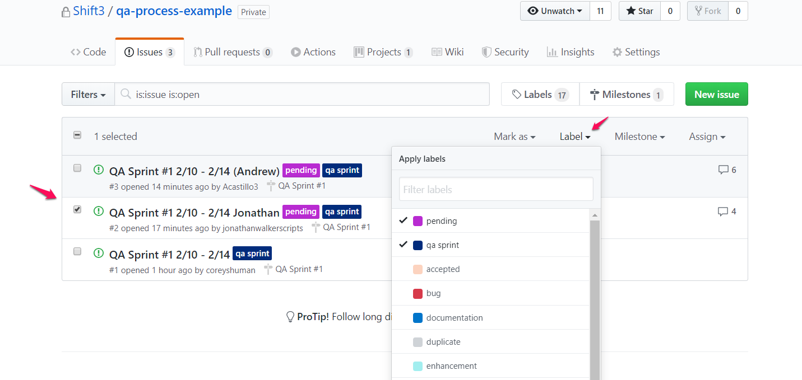

 #  QA Sprint Process
## Project-Under-Test is Prepared
- For mobile apps: Application is made available on Testflight or loaded onto test devices. Application should be deployed to the Client’s Apple and Google accounts.
- For web apps: Site is deployed to a staging server. Staging server should live on clients hosting provider.
- Developer or PM prepares an Acceptance Test per the Bitwise guidelines.
- PM or Lead Dev will create a milestone for the QA Sprint with:
  - Milestone deadline
  - Short project or feature description
- PM or Lead Dev will create a project board for the QA Sprint.
  - Pending
  - Accepted
  - In Progress
  - Ready for Retest
  - Done
  - Rejected

  

- PM or Lead Dev will create the “QA Sprint” issue with:
  - Short project or feature description
  - Delivery/testing timeframe
  - Associated milestone containing Definition of Done
  - Associated project board
  - Sandbox URL/ Testflight App Name
  - App Version number(s) to be tested
  - Devices / Browsers to be tested
  - Definition of Done
  - Acceptance test in Markdown Format. An acceptance test will be necessary for all new projects. If you would like a tutorial on creating an acceptance test please contact qa@bitwiseindustries.com and we can set up a meeting to get you started.

  

## Scheduling QA
1. PM (or lead dev) sends an email to qa@bitwiseindustries.com. If the lead dev sends the email, cc your PM on the email.
  - Provide the following details:
```
    - Project and client name
    - Billable to client?
    - Task description
    - Due date (or estimate of testing time required)
    - Names of PM and lead dev
    - Scope of work
    - List of known issues
```
2. QA leads receives the project and assigns it to the QA team / PM on monday.com. Deadline is set up, a timeline is scheduled, and calendar invites are sent.

## Testing Kickoff
1. Testing kickoff meeting occurs. PM or Dev will introduce the QA team to the Project-Under-Test.
2. QA team meets to review the application and its purpose in order to better understand the most important functions of the website before diving in.
3. PM / Dev defines the priorities for testing and defines the “Definition of Done”. 
    - Are there any specific devices we should be looking at?
    - What types of testing will we be doing for this project?
    - Are there any forms of [compliance](https://www.google.com/url?q=https://docs.google.com/document/d/16_9HWZa2lmvAUeWNv0WD68oRlruZHlG3xGVGqg3EScw/edit?usp%3Dsharing&sa=D&source=editors&ust=1620757751653000&usg=AOvVaw1-rFvNAvKO15isaEe1P2oL) that need to be followed?
4. Points of contact are defined.
5. Identify known issues to be ignored or are outside of scope.
6. Post Sprint Meeting is scheduled

## Access Given (during kickoff meeting)
1. Desired browsers and devices to be tested on are identified.
2. Team is assigned to the project repo on Github in order to post issues and coordinate with developers. (This will be Write access)
3. If applicable, review for each user types abilities and limitations.
4. Credentials are given to the team via **Zoho Vault**. (BWTC-QA Chamber)
5. If QA is billable to the client, such as for T&M projects, PM will add the QA team to the Tick project.

# Testing Process
## For QA:

1. If a project board has not been set up by the developer, QA will set up a project board for this sprint by copying from the [example board](https://github.com/Shift3/qa-team/projects/9) on github.
2. If not already added by developer, QA will add the milestone and labels relevant for this sprint will to ensure that items are displayed and sorted correctly on the project board. Milestone will contain projects Definition of Done.
3. QA Testers will create a “Working” issue to work from, copy the Acceptance Test from the “QA Sprint” issue into the first comment, and use that to check off each tested feature. Items that have already been tested should not be unchecked unless they no longer work.
4. Discussions should occur constantly within the “Working” issue, tagging people as necessary.

  

5. QA can generate new issues for discovered problems.
Issue will be labeled with “Pending” and “QA Sprint”
Issue will be assigned to relevant milestone and project board
Issue will be assigned to Point of Contact

  

6. When the issue is ready for Retest and deployed to a new test version, the issue will be moved to “Ready for Retest”. QA members will be assigned and notified.
7. If the test is successful, QA Tester adds the “Testing Passed” label to the issue. Issue assigned to POC.
8. If the testing failed, QA will add feedback on the issue and add the “Testing Failed” label.
9. Upon completion of the QA Sprint, the POC will close the “Working” issues and “QA Sprint” issue.

## For PM/Lead Developer:
1. Discussions should occur constantly within the “Working” issue, tagging people as necessary.

 

2. PM/Lead Dev can generate new issues for discovered problems.
a. Issue will be labeled with “Pending” and “QA Sprint”
b. Issue will be assigned to relevant milestone and project board
c. Issue will be assigned to Point of Contact

  

3. POC will review the new issues. “Pending” label will be removed. Comments added as necessary. New labels will be applied based on required actions:
a. Labels:
 **i.** Enhancement
 **ii.** Bug
 **iii.** Hold
 **iv.** ...
4. PM/Lead Dev will drag issues into the accepted or rejected column of the Project Board and update the labels to match the column. Accepted issues are assigned to developers. Rejected issues are unassigned.

  

5. Developers will drag items into the “In Progress” board when addressing the issue. The developer will add the “In Progress” issue label.
6. When the issue is ready for Retest and deployed to a new test version, the issue will be dragged to “Ready for Retest”. The issue label should be updated from “In Progress” to “Ready for Retest”. QA members will be assigned.
7. If the issue is marked as “Testing Failed”, drag the item to “In Progress”
8. If the issue is marked as “Testing Passed”, drag the item to “Done” and close the issue if applicable
9. Upon completion of the QA Sprint, the **POC will close the “Working” issues and “QA Sprint” issue**.

## For Developer:
1. Discussions should occur constantly within the “Working” issue, tagging people as necessary.

  

2. Developers will drag items into the “In Progress” board when addressing the issue. The developer will add the “In Progress” issue label.

  

3. When the issue is ready for Retest and deployed to a new test version, the issue will be dragged to “Ready for Retest”. The issue label should be updated from “In Progress” to “Ready for Retest”. QA members will be assigned. Assigned developer will notify the QA team of EVERY PUSH! This is important because a push can work perfectly fine on one end, but break on QA’s end if they haven’t emptied the cache and hard reloaded.
4. If the test is successful, QA Tester adds the “Testing Passed” label to the issue. Issue assigned to POC.
5. If the testing failed, QA will add feedback on the issue and add the “Testing Failed” label.
6. If the issue is marked as “Testing Passed”, drag the item to “Done” and close the issue if applicable
7. Upon completion of the QA Sprint, the POC will close the “Working” issues and “QA Sprint” issue.

## Post Sprint Meeting
This is an optional meeting for the PM and will be scheduled on the proposed end date with the lead dev if testing is not completed to the satisfaction of definition of done.
1. QA and dev will review the acceptance test to see what items may have not been marked off.
2. QA and dev will go over any issues that are still open and issues that need a more thorough explanation if necessary.
3. QA will close the sprint milestone to mark the end of the sprint.
4. QA will send a Certificate of Completion to the PM and lead dev. This certificate will show what testing (exploratory, acceptance test, ADA, etc.) was done during this sprint along with the applications Google Lighthouse score.

## Requesting a New Sprint
### Acceptance Test
a. If new features have been added, the acceptance test will need to be updated and sent to the QA team for the new sprint.
b. If the application has no major updates the QA team will copy the last acceptance test and use that for the current sprint.


# Appendix A - Definitions
## Acceptance Testing
An acceptance test is a checklist that explains the applications functions step by step while also getting the user(s) familiar with the application.
1. An acceptance test is either
a. Provided for the QA team or
b. Created by the QA team as they maneuver the application

2. QA team works through the acceptance test to ensure that the application is working as intended.
